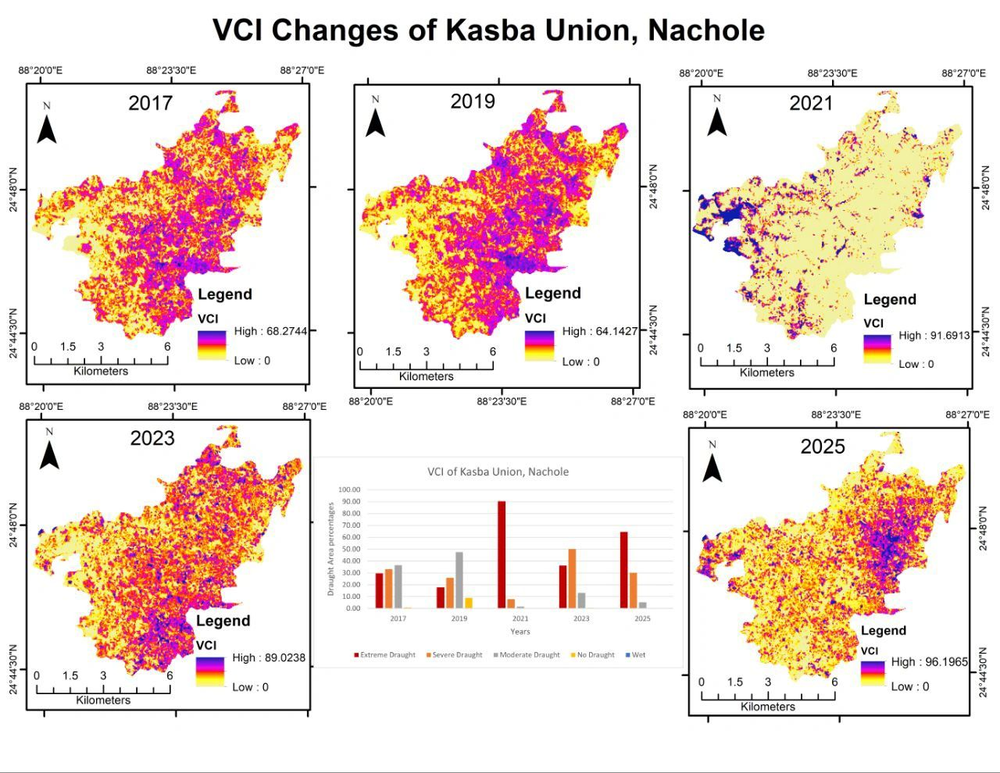

# VCI-Based Drought Assessment of Kasba Union, Nachole (2017–2025)



## Overview

This repository presents a **multi-temporal drought assessment** of **Kasba Union, Nachole Upazila, Chapainawabganj District, Bangladesh** using the **Vegetation Condition Index (VCI)** derived from satellite imagery.

The study analyzes vegetation stress and drought conditions for the years **2017, 2019, 2021, 2023, and 2025** using remote sensing and GIS techniques. VCI provides valuable insights into vegetation health and helps identify areas experiencing **drought stress or favorable vegetation conditions**.

This analysis demonstrates the usefulness of **satellite-based environmental monitoring** for understanding drought dynamics and supporting climate resilience planning.

---

## Study Area

The study focuses on **Kasba Union**, located in **Nachole Upazila, Chapainawabganj District, Bangladesh**.

This region is characterized by **agricultural activities and seasonal climatic variability**, making it vulnerable to drought conditions. Monitoring vegetation health through remote sensing provides important information for environmental management and agricultural planning.

---

## Vegetation Condition Index (VCI)

The **Vegetation Condition Index (VCI)** is widely used for **drought monitoring and vegetation stress assessment**.

VCI is derived from NDVI values and compares current vegetation conditions with historical vegetation conditions.

### Formula

```
VCI = (NDVI - NDVImin) / (NDVImax - NDVImin) × 100
```

Where:

- **NDVI** = Current NDVI value  
- **NDVImin** = Minimum NDVI value over a given period  
- **NDVImax** = Maximum NDVI value over a given period  

VCI values range from **0 to 100**.

---

## VCI Interpretation

| VCI Value | Drought Condition |
|-----------|------------------|
| 0 – 20 | Extreme Drought |
| 20 – 40 | Severe Drought |
| 40 – 60 | Moderate Drought |
| 60 – 80 | Normal Vegetation |
| 80 – 100 | Healthy / Wet Conditions |

Lower VCI values indicate **vegetation stress and drought conditions**, while higher values represent **healthy vegetation**.

---

## Data Source

Satellite imagery used in this analysis:

- **Satellite:** Landsat 8
- **Sensor:** OLI/TIRS
- **Years analyzed:**
  - 2017
  - 2019
  - 2021
  - 2023
  - 2025

The data were obtained from **USGS EarthExplorer**.

---

## Methodology

The drought assessment followed these steps:

1. Acquisition of Landsat 8 satellite imagery
2. Preprocessing and preparation of raster datasets
3. Calculation of **NDVI (Normalized Difference Vegetation Index)**
4. Derivation of **Vegetation Condition Index (VCI)**
5. Classification of drought severity levels
6. Spatial analysis and visualization of drought patterns

This approach allows monitoring of **temporal changes in vegetation stress and drought conditions** across the study area.

---

## Tools & Software

The analysis and map preparation were conducted using:

- **ArcMap (ArcGIS Desktop)**
- Remote sensing raster processing tools
- GIS spatial analysis tools
- Cartographic visualization techniques

---

## Key Insights

The multi-temporal VCI analysis reveals:

- Spatial variability in drought conditions across Kasba Union
- Temporal fluctuations in vegetation stress between 2017–2025
- Periods of significant drought intensity in certain years
- The effectiveness of remote sensing for drought monitoring

---

## Repository Contents

```
VCI
│
├── VCI.jpeg      # Multi-temporal VCI drought analysis maps
├── README.md     # Project documentation
└── LICENSE       # MIT License
```

---

## Author

**Md. Habibullah Masbah**  
Undergraduate Student  
ID:2107046  
Department of Urban & Regional Planning  
Rajshahi University of Engineering & Technology (RUET), Bangladesh

---

## License

This project is licensed under the **MIT License**.

See the **LICENSE** file for more details.
